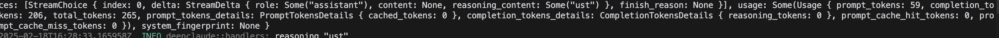
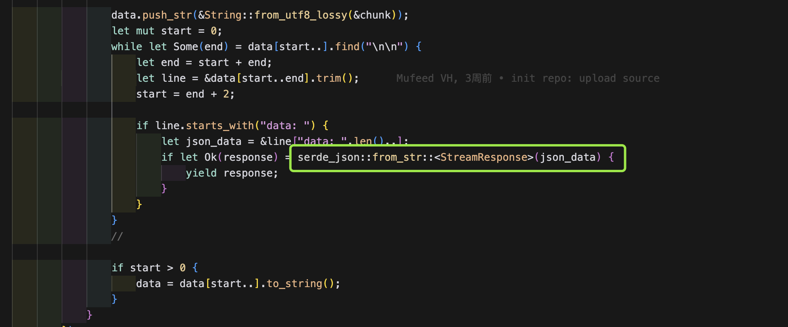
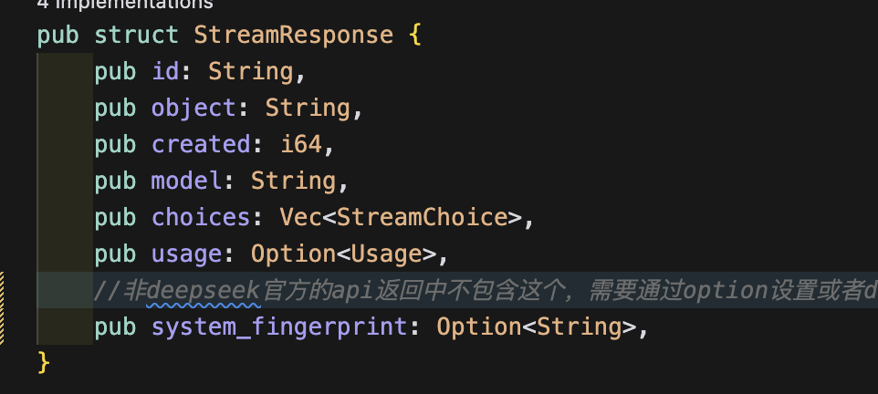
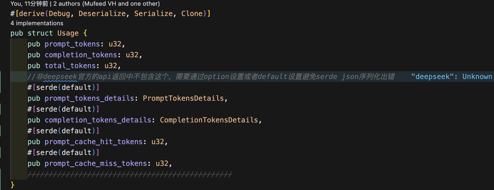
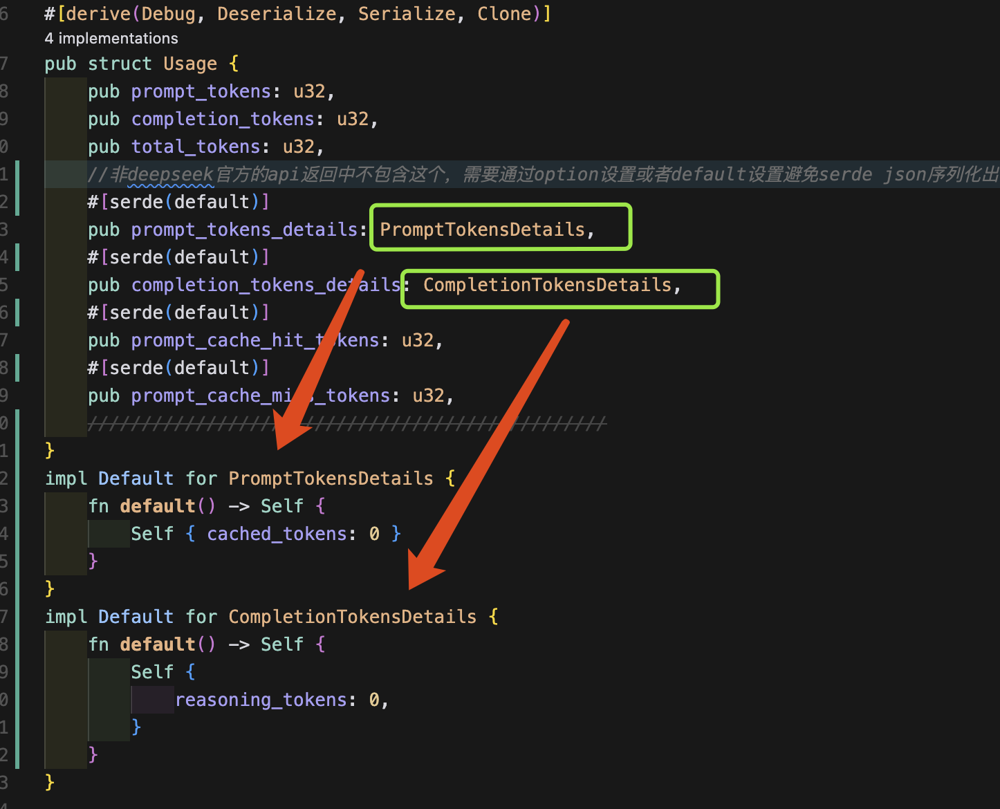
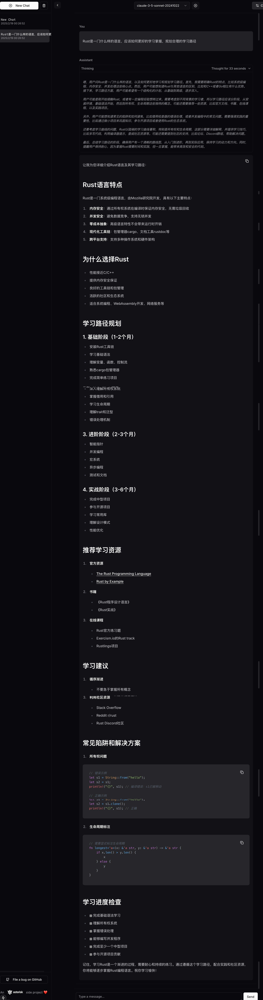
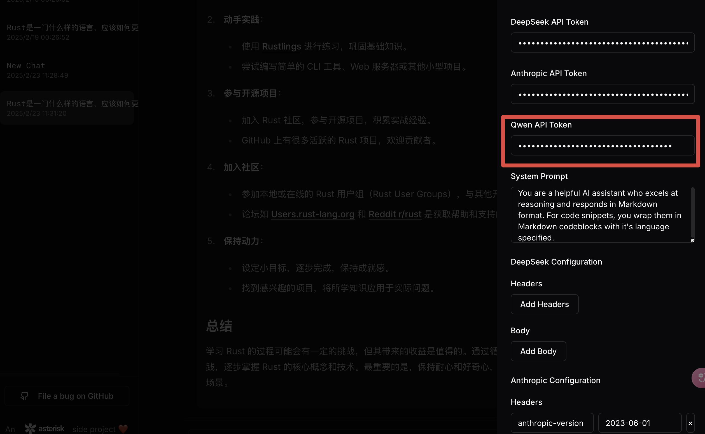
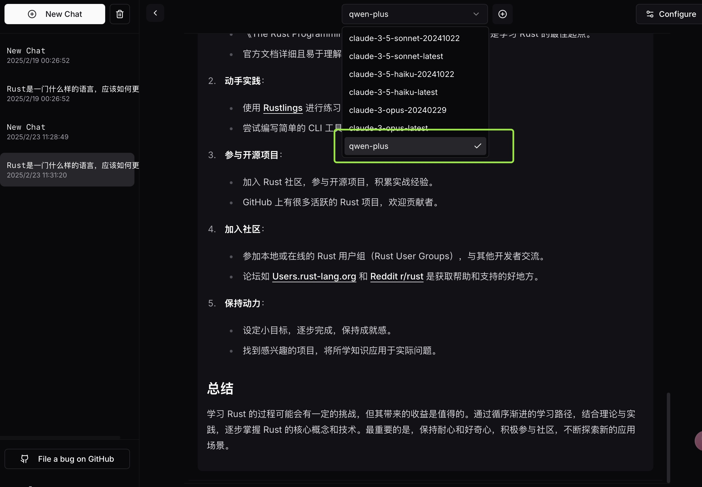

## Why R1 + Claude?

DeepSeek R1's CoT trace demonstrates deep reasoning to the point of an LLM experiencing "metacognition" - correcting itself, thinking about edge cases, and performing quasi Monte Carlo Tree Search in natural language.

However, R1 lacks in code generation, creativity, and conversational skills. Claude 3.5 Sonnet excels in these areas, making it the perfect complement. DeepClaude combines both models to provide:

- R1's exceptional reasoning and problem-solving capabilities
- Claude's superior code generation and creativity
- Fast streaming responses in a single API call
- Complete control with your own API keys

## Getting Started

### Prerequisites

- Rust 1.75 or higher
- DeepSeek API key
- Anthropic API key

### Installation

1. Build the project:
```bash
cargo build --release
```

### Configuration

Create a `config.toml` file in the project root:

```toml
[server]
host = "127.0.0.1"
port = 3000

[pricing]
# Configure pricing settings for usage tracking
```


### Basic Example

```python
import requests

response = requests.post(
    "http://127.0.0.1:1337/",
    headers={
        "X-DeepSeek-API-Token": "<YOUR_DEEPSEEK_API_KEY>",
        "X-Anthropic-API-Token": "<YOUR_ANTHROPIC_API_KEY>"
    },
    json={
        "messages": [
            {"role": "user", "content": "How many 'r's in the word 'strawberry'?"}
        ]
    }
)

print(response.json())
```

### Streaming Example

```python
import asyncio
import json
import httpx

async def stream_response():
    async with httpx.AsyncClient() as client:
        async with client.stream(
            "POST",
            "http://127.0.0.1:1337/",
            headers={
                "X-DeepSeek-API-Token": "<YOUR_DEEPSEEK_API_KEY>",
                "X-Anthropic-API-Token": "<YOUR_ANTHROPIC_API_KEY>"
            },
            json={
                "stream": True,
                "messages": [
                    {"role": "user", "content": "How many 'r's in the word 'strawberry'?"}
                ]
            }
        ) as response:
            response.raise_for_status()
            async for line in response.aiter_lines():
                if line:
                    if line.startswith('data: '):
                        data = line[6:]
                        try:
                            parsed_data = json.loads(data)
                            if 'content' in parsed_data:
                                content = parsed_data.get('content', '')[0]['text']
                                print(content, end='',flush=True)
                            else:
                                print(data, flush=True)
                        except json.JSONDecodeError:
                            pass

if __name__ == "__main__":
    asyncio.run(stream_response())
```

## Configuration Options

The API supports extensive configuration through the request body:

```json
{
    "stream": false,
    "verbose": false,
    "system": "Optional system prompt",
    "messages": [...],
    "deepseek_config": {
        "headers": {},
        "body": {}
    },
    "anthropic_config": {
        "headers": {},
        "body": {}
    }
}
```


通过streaming方式从模型获取Json内容的时候，目前国内各大厂商提供的模型API区别于DeepSeek原生API会有一定的Json结构变化。开始一直不明白为什么serde json序列化会出错，没有想到是各大API厂商提供的R1数据结构不一致


就是这里因为各厂商提供的API Json格式不同导致了serde json序列化出错，获取不到deepseek模型推理内容返回，导致不能将推理结构结构化提交给Claude 3.5 Sonnet进行最终生成。






不返回的Json数据结构可以通过 Option或者Defualt实现



对于Struct类型需要手工实现Default




增加Qwen 生成支持
```
curl -X POST "http://127.0.0.1:1337" \
-H "Content-Type: application/json" \
-H "Accept: application/json" \
-H "X-DeepSeek-API-Token:<API_KEY>" \
-H "X-Anthropic-API-Token:<API_KEY>" \
-H "X-Qwen-API-Token:<API_KEY>" \
-d '{
  "stream": true,
  "verbose": false,
  "model": "qwen-plus",
  "messages": [
    {
      "content": "Rust是一门什么样的语言，应该如何更好的学习掌握，规划合理的学习路径",
      "role": "user"
    }
  ],
 "system":"You are a helpful AI assistant who excels at reasoning and responds in Markdown format. For code snippets, you wrap them in Markdown codeblocks with it is language specified."
}'
```



